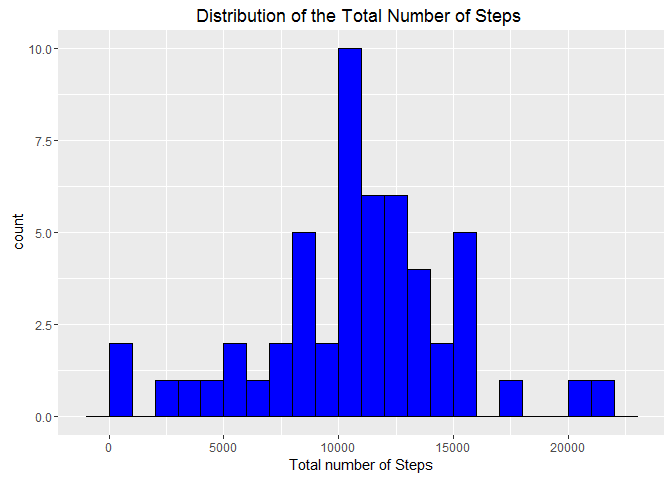
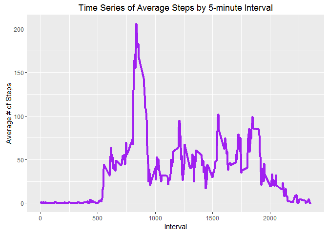

# Reproducible Research: Peer Assessment 1


## Loading and preprocessing the data

First, I loaded the data in using read.csv().  The code assumes that the folder containing the dataset is your working directory, and is called "activity.csv".  Because it is a zip file, the unz() function is used to open a connection inside the zip file and extract the csv file.  The gc() function is the safest and easiest way to close the connection after the data is read in.   


```r
amd <- read.csv(unz("activity.zip", "activity.csv"))
gc()
```

```
##          used (Mb) gc trigger (Mb) max used (Mb)
## Ncells 304966 16.3     592000 31.7   350000 18.7
## Vcells 523478  4.0    1023718  7.9   945743  7.3
```
Here is an overview of what the data looks like:


```r
head(amd)
```

```
##   steps       date interval
## 1    NA 2012-10-01        0
## 2    NA 2012-10-01        5
## 3    NA 2012-10-01       10
## 4    NA 2012-10-01       15
## 5    NA 2012-10-01       20
## 6    NA 2012-10-01       25
```

```r
str(amd)
```

```
## 'data.frame':	17568 obs. of  3 variables:
##  $ steps   : int  NA NA NA NA NA NA NA NA NA NA ...
##  $ date    : Factor w/ 61 levels "2012-10-01","2012-10-02",..: 1 1 1 1 1 1 1 1 1 1 ...
##  $ interval: int  0 5 10 15 20 25 30 35 40 45 ...
```

The date variable then needs to be converted into a date format, using the as.Date() function.    

```r
amd$date <- as.Date(amd$date, "%Y-%m-%d")

##Verify that reformatting was successful

class(amd$date)
```

```
## [1] "Date"
```

Lastly, group the data by date and time interval, using the group_by() function in the dplyr package. 


```r
library(dplyr)
grp_by_date <- group_by(amd, date)
grp_by_interval <- group_by(amd, interval)
```

## What is mean total number of steps taken per day?

Using the summarize function from dplyr.  


```r
totalSteps <- summarize(grp_by_date, sum=sum(steps))
```

Here is a histogram, which shows the distribution of the number of steps taken per day:


```r
library(ggplot2)
ggplot() + aes(na.omit(totalSteps$sum)) + geom_histogram(binwidth = 1000, color = "black", fill = "blue") + labs(title = "Distribution of the Total Number of Steps ", x = "Total number of Steps")
```

 

The mean and median of the total steps taken per day can calculated fom the same dataset:


```r
mean(totalSteps$sum, na.rm = TRUE)
```

```
## [1] 10766.19
```

```r
median(totalSteps$sum, na.rm = TRUE)
```

```
## [1] 10765
```


## What is the average daily activity pattern?

First we prep the data for analysis.  


```r
averageSteps <- summarize(grp_by_interval, mean = mean(steps, na.rm = TRUE))
```

Here is the time series plot by time interval:


```r
ggplot() + aes(averageSteps$interval, averageSteps$mean) + geom_line(size = 1.5, color = "purple") + labs(title = "Time Series of Average Steps by 5-minute Interval", x = "Interval", y = "Average # of Steps")
```

 

The interval with the most number of steps is given in the following code:


```r
as.numeric(averageSteps[which.max(averageSteps$mean), 1])
```

```
## [1] 835
```


## Imputing missing values


## Are there differences in activity patterns between weekdays and weekends?
